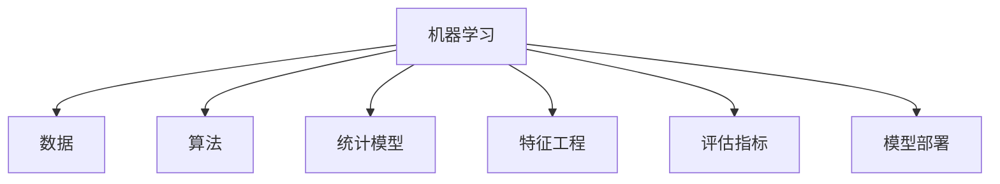

<p align="center">
  <a href="README.md">English</a> | <strong>中文</strong>
</p>


<!--   my-icons -->
<p align="center">
    <a href="https://github.com/ljy969/ljy969"></a>
    <a href="https://github.com/python/cpython"></a>
    <a href="https://github.com/ljy969/ljy969/graphs/contributors"></a>
    <a href="https://github.com/ljy969/ljy969/stargazers"></a>
    <a href="https://github.com/ljy969/ljy969/network/members"></a>
       
</p>


<!--   my-header-img -->

<a href="https://www.python.org/"></a>

## 我是 MOX

> 一名高一学生

### 🛠️ 技术栈

- **编程语言:** Python, HTML, Go
- **操作系统:** Linux
- **发展方向:** 前端开发、脚本开发
- **学习方式:** 自学成才

### 👤 关于我

持续探索各类前沿技术，不断积累编程实战经验。


<!--   my-skils -->

| 分类 | 技能详情 |
| :--- | :--- |
| **语言 / IDE** |    |
| **领域知识** | [](https://github.com/ljy969/ljy969) [](https://github.com/search?q=user%3Aljy969&type=Repositories) [](https://github.com/search?q=user%3Aljy969&type=Repositories) [](https://github.com/search?q=user%3Aljy969&type=Repositories) |
| **CI / CD** | [](https://github.com/BEPb/BEPb)   [](https://www.docker.com) [](https://code.visualstudio.com) |
| **数据库** |   |
| **机器学习 / 深度学习框架** |            |

[](https://git.io/streak-stats)

<!--   machine-learning -->


#### 感谢您的访问 :heart:

## ⭐ Star 历史

[](https://www.star-history.com/?repos=ljy969%2Fljy969&type=timeline&logscale=&legend=top-left)

[MIT 许可证](LICENSE)

</p>

---
*如果您喜欢我的个人主页，欢迎 Star ⭐ 本仓库；如需使用此模板，请 Fork 后自行修改。*
---


```
